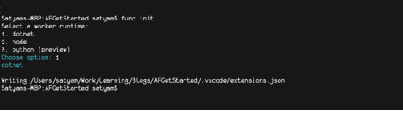
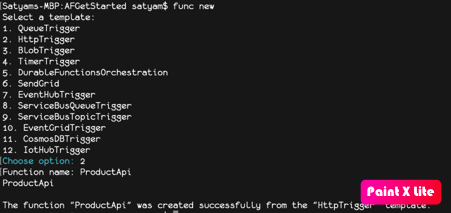
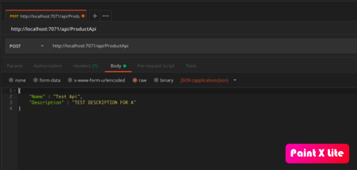
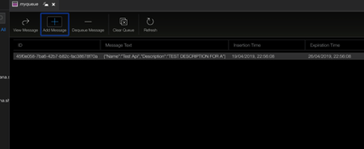

# Creating Event Triggered Azure function

We will be creating a simple sample which takes Name and description of product using rest endpoint and store in SQL Server Table.

-   Creating Http Trigger (Rest Api) azure function endpoint which will be allow user to post product details (name and description)
-   Http Trigger endpoint will save the information in Queue.
-   Creating QueueTrigger azure function which will listen to storage queue and insert this information in database

# Architectural diagram


# Tools & Tecnology 

* [Visual Studio Code](https://docs.microsoft.com/en-us/azure/azure-functions/functions-create-first-function-vs-code) Development of Azure function with cross platform editor.
* [Dotnet Core](https://dotnet.microsoft.com/download) Cross platform dotnet framework
* Azure Stoage Account
* [Azure Storage Explore](https://azure.microsoft.com/en-us/features/storage-explorer/) To view and manage Table, Queue , blob of storage account
* Sql Server
* [Azure Storage Queue](https://docs.microsoft.com/en-us/azure/storage/queues/storage-queues-introduction) Storage Message Queue

# Start with Creation of ProductApi

-   Create Azure function using core tool 
    * Open terminal and create directory "AFGetStrated" (mkdir AFGetStarted && cd AFGetStarted)
    * run func init command and select dotnet as option

    

    * run func new command and select HttpTrigger option. Give name as ProductApi

      

    Now we need to update productApi to save message in Queue
    
    Product Api have Post method which takes product details and insert the details in Queue “myqueue” and using same storage which configured for Azure function.

    # ProductApi.cs

    ```sh
    if (req.Method.ToLowerInvariant() == “post”) {
    //if post then read body and convert to product details to validate the model
    var productDetails = JsonConvert.DeserializeObject<ProductDetails> (requestBody);
    //Now product detail is available then save the message into queue.
    _queueService.SendMessageAsync (JsonConvert.SerializeObject (productDetails)).GetAwaiter ().GetResult ();
    }
    ```

    # local.settings.json
    ```sh
    {
    "IsEncrypted": false,
    "Values": {
        "AzureWebJobsStorage": “storage connection string",
        "FUNCTIONS_WORKER_RUNTIME": "dotnet",
        "QueueName": "myqueue"
        }
    }
    ```
    * Take complete code from repository from api branch and build the same.
    * Configure Azure storage and create queue with myqueue name in storage. Update the local.settings.json file
    * Build and run the code from command line

    ```sh
    $ dotnet build
    $ func start
    ```

    Now Api will be hosted in URL “http://localhost:7071/api/ProductApi"
   
    Open [PostMan](https://www.getpostman.com) and request Post URL to create product detail

    

    Open queue from storage explored and we will see the queue inserted with product detail.

    

    As next step we will be writting Queue trigger function to save data in database (event branch)


