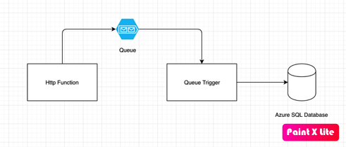

# Creating Event Triggered Azure function

We will be creating a simple sample which takes Name and description of product using rest endpoint and store in SQL Server Table.

-   Creating Http Trigger (Rest Api) azure function endpoint which will be allow user to post product details (name and description)
-   Http Trigger endpoint will save the information in Queue.
-   Creating QueueTrigger azure function which will listen to storage queue and insert this information in database

# Architectural diagram

# Tools & Tecnology 

* [Visual Studio Code](https://docs.microsoft.com/en-us/azure/azure-functions/functions-create-first-function-vs-code) Development of Azure function with cross platform editor.
* [Dotnet Core](https://dotnet.microsoft.com/download) Cross platform dotnet framework
* Azure Stoage Account
* [Azure Storage Explore](https://azure.microsoft.com/en-us/features/storage-explorer/) To view and manage Table, Queue , blob of storage account
* Sql Server
* [Azure Storage Queue](https://docs.microsoft.com/en-us/azure/storage/queues/storage-queues-introduction) Storage Message Queue

- [Creating Rest endpoint to save data in Queue](Docs/HttpTrigger.md)
- [Creating Event Processor to save queue message to Product Details](Docs/EventProcessor.md)

